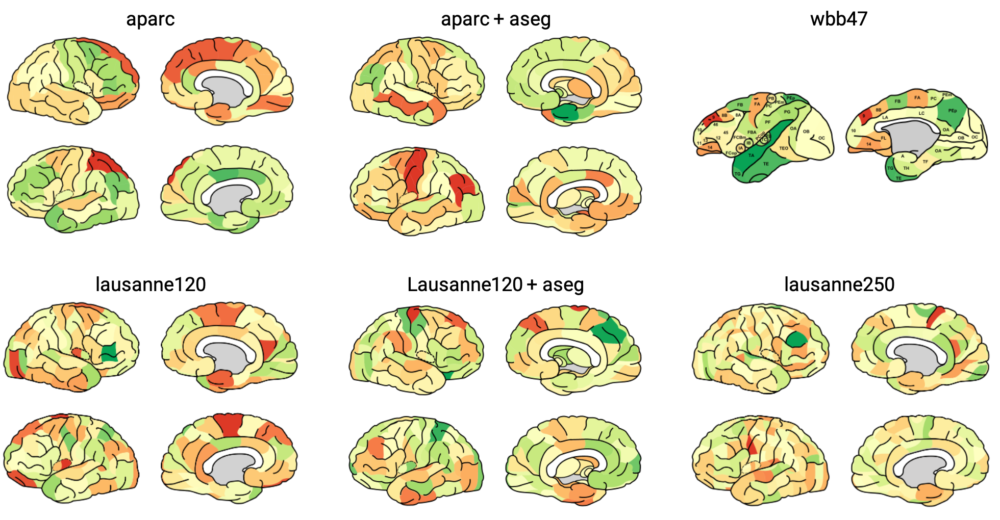

# Simple brain plot

brainPlot is a MATLAB function to create simple line-art brain plots.



## Atlases available

This tool can be used to visualize the brain for the following atlases:
* ‘Desikan-Killiany’ APARC cortical atlas as present in FreeSurfer [1].
* ‘Desikan-Killiany’ APARC+ASEG combined cortical and subcortical atlas as present in FreeSurfer [1].
* 120 regions Cammoun sub-parcellation of the Desikan-Killiany cortical atlas [2].
* 120 regions Cammoun sub-parcellation of the Desikan-Killiany cortical atlas with ASEG subcortical regions [2].
* 250 regions Cammoun sub-parcellation of the Desikan-Killiany atlas [2].
* Combined Walker-von Bonin and Bailey (WBB47) parcellation atlas of the macaque [3][4][5][6].


## Installation

1. Download/clone this repository and save it in a directory, e.g. `~/MATLAB`
2. Locate the simple-brain-plot directory and add this directory to your MATLAB path using the addpath command:
```
addpath('~/MATLAB/simple-brain-plot')
```

## Usage

`plotBrain(regions, values, cm)` - regions describes a list (Nx1) of
regions to color. Values is an vector with the values associated with
each region (Nx1). Variable cm is the colormap (Mx3) to which values are
mapped

`plotBrain(regions, values, cm, ...)` - plots surfaces with
optional arguments:
```
'limits'     array with [xmin xmax]
             - default: [min(values) max(values)]
'viewer'     scalar with 1/true (show) or 0/false (no show)
             - default: 1 (show)
'savePath'   path to save file 'savePath'_lausanne120_combined.svg
             - default: temporary dir, deleted afterwards.
'scaling'    set scaling of image. Original scaling is very large, but
             smaller scalings show small white lines
             - default: '0.1' (10%)
'atlas'      chose which atlas to use
             'aparc'            - Desikan-Killiany atlas
             'aparc_aseg'       - Desikan-Killiany atlas + subcortical ASEG
                                  segmentation
             'lausanne120'      - 120 regions Cammoun sub-parcellation of
                                  the Desikan-Killiany atlas
             'lausanne120_aseg' - 120 regions Cammoun sub-parcellation +
                                  subcortical ASEG segmentation
             'lausanne250'      - 250 regions Cammoun sub-parcellation
             'wbb47'            - Cobined Walker-von Bonin and Bailey
                                  parcellation atlas of the macaque
             - default: 'lausanne120'
```

## Example
First create the colormap used (one can also use the standard MATLAB colormap). This one is based on the [cbrewer YlGnBu-colormap](https://mathworks.com/matlabcentral/fileexchange/34087)
```
cm = [0.8431    0.1882    0.1529; ...
    0.9569    0.4275    0.2627; ...
    0.9922    0.6824    0.3804; ...
    0.9961    0.8784    0.5451; ...
    1.0000    1.0000    0.7490; ...
    0.8510    0.9373    0.5451; ...
    0.6510    0.8510    0.4157; ...
    0.4000    0.7412    0.3882; ...
    0.1020    0.5961    0.3137];
cm = interp1(cm, 1:0.01:size(cm,1));
```

Make directory with example surfaces
```
[~, ~] = mkdir('examples');
```

Load region names for all atlases
```
load('regionDescriptions.mat');
```

### Visualize atlases
APARC + aseg atlas
```
plotBrain(regionDescriptions.aparc_aseg, ...
    randn(size(regionDescriptions.aparc_aseg)), cm, ...
    'atlas', 'aparc_aseg', ...
    'savePath', 'examples/figure');
```

APARC atlas
```
plotBrain(regionDescriptions.aparc_aseg, ...
    randn(size(regionDescriptions.aparc_aseg)), cm, ...
    'atlas', 'aparc', ...
    'savePath', 'examples/figure');
```

Lausanne120 + aseg atlas
```
plotBrain(regionDescriptions.lausanne120_aseg, ...
    randn(size(regionDescriptions.lausanne120_aseg)), cm, ...
    'atlas', 'lausanne120_aseg', ...
    'savePath', 'examples/figure');
```

Lausanne120 atlas
```
plotBrain(regionDescriptions.lausanne120_aseg, ...
    randn(size(regionDescriptions.lausanne120_aseg)), cm, ...
    'atlas', 'lausanne120', ...
    'savePath', 'examples/figure');
```

Lausanne250 atlas
```
plotBrain(regionDescriptions.lausanne250, ...
    randn(size(regionDescriptions.lausanne250)), cm, ...
    'atlas', 'lausanne250', ...
    'savePath', 'examples/figure');
```

WBB47 atlas
```
plotBrain(regionDescriptions.wbb47, ...
    randn(size(regionDescriptions.wbb47)), cm, ...
    'atlas', 'wbb47', ...
    'savePath', 'examples/figure');
```

### Advanced
Let the color axis center around 0 using the `limits` option.

```
values = randn(size(regionDescriptions.aparc_aseg));
plotBrain(regionDescriptions.aparc_aseg, ...
    randn(size(regionDescriptions.aparc_aseg)), cm, ...
    'atlas', 'aparc', ...
    'limits', [-max(abs(values)) max(abs(values))]);
```


## Notes

## References
[1] Rahul S. Desikan, Florent Ségonne, Bruce Fischl, Brian T. Quinn, Bradford C. Dickerson, Deborah Blacker, Randy L. Buckner, Anders M. Dale, R. Paul Maguire, Bradley T. Hyman, Marilyn S. Albert, and Ronald J. Killiany. An automated labeling system for subdividing the human cerebral cortex on mri scans into gyral based regions of interest. NeuroImage, 31(3):968–80, 2006. URL: http://www.sciencedirect.com/science/article/pii/S1053811906000437, doi:10.1016/j.neuroimage.2006.01.021.

[2] Leila Cammoun, Xavier Gigandet, Djalel Meskaldji, Jean Philippe Thiran, Olaf Sporns, Kim Q. Do, Philippe Maeder, Reto Meuli, and Patric Hagmann. Mapping the human connectome at multiple scales with diffusion spectrum mri. Journal of Neuroscience Methods, 203(2):386–397, 2012. doi:10.1016/j.jneumeth.2011.09.031.

[3] Lianne H. Scholtens, Ruben Schmidt, Marcel A. de Reus, Martijn P. van den Heuvel. Linking Macroscale Graph Analytical Organization to Microscale Neuroarchitectonics in the Macaque Connectome. Journal of Neuroscience 3 September 2014, 34 (36) 12192-12205; URL: https://www.jneurosci.org/content/34/36/12192.short DOI: 10.1523/JNEUROSCI.0752-14.2014

[4] Stephan KE, Hilgetag CC, Burns GA, O'Neill MA, Young MP, Kötter R. Computational analysis of functional connectivity between areas of primate cerebral cortex. Philos Trans R Soc Lond B Biol Sci 355:111–126, 2000. doi:10.1098/rstb.2000.0552, pmid:10703047

[5] von Bonin G, Bailey P. The neocortex of Macaca mulatta. 1947. University of Illinois, Urbana, IL.

[6] Walker EA. A cytoarchitectural study of the prefrontal area of the macaque monkey. J Comp Neurol 73:59–86, 1940. doi:10.1002/cne.900730106

